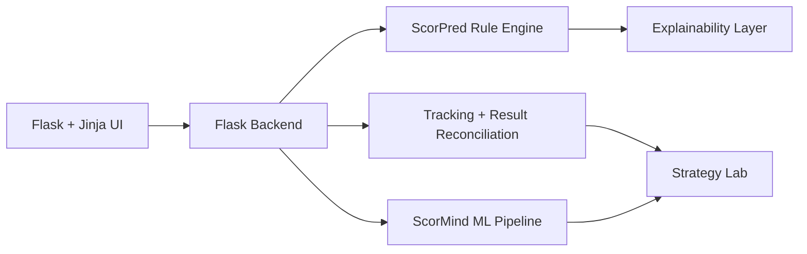
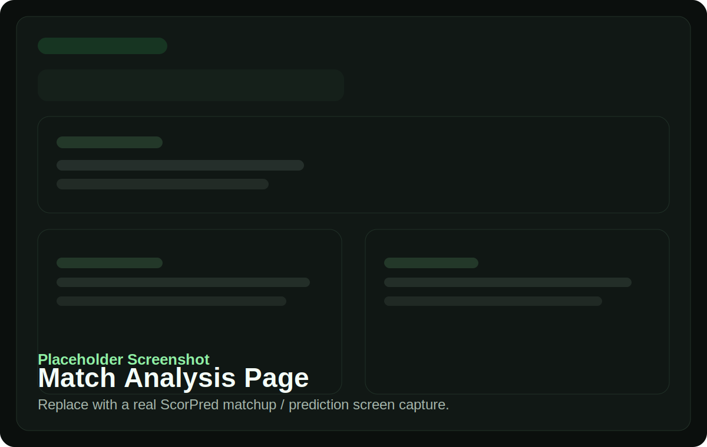
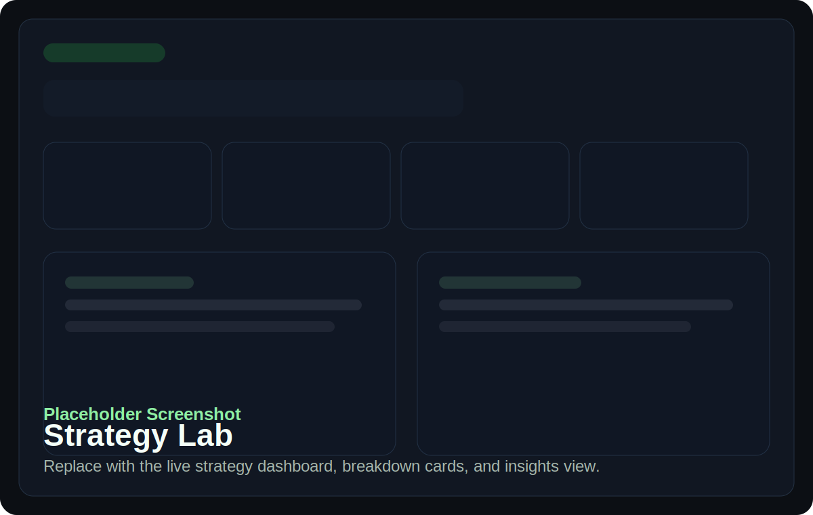
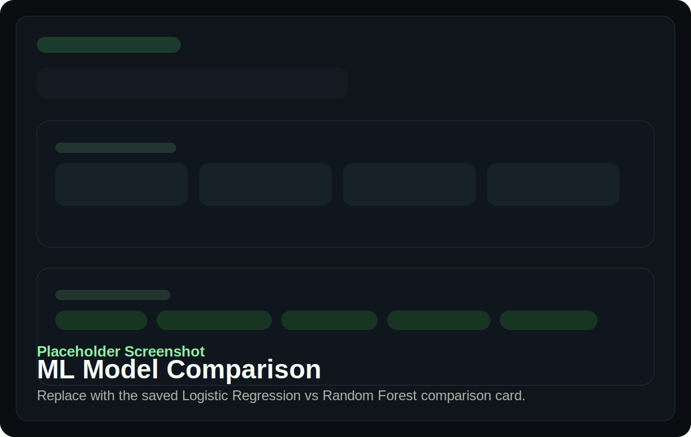

# ScorPred — Sports Decision Intelligence Platform

A full-stack analytics system that combines rule-based modeling and machine learning to generate explainable, data-driven match recommendations.

**Portfolio snapshot**

- **Stack:** Python, Flask, Jinja, scikit-learn, pytest
- **Sports covered:** Soccer and NBA
- **Core value:** Explainable recommendations, not black-box picks
- **Current local test baseline:** `115 passing tests` on April 13, 2026
- **CI:** GitHub Actions runs the test suite on push and pull request

## What It Does

- Analyzes soccer and NBA matchups using form, injuries, H2H context, standings, and team trends
- Generates a final recommendation through weighted rule-based modeling
- Explains predictions with key drivers, confidence, and risk context
- Tracks historical performance and reconciles predictions against completed results
- Compares strategies through tracked backtesting views in Strategy Lab
- Evaluates ML baselines with Logistic Regression vs Random Forest

## Demo Flow

1. Select a soccer fixture or NBA game from the app home flow.
2. Open the Match Analysis / Prediction view to inspect the recommendation, edge, and explanation.
3. Add a pick or prop to the bet-slip-style workflow.
4. Visit Strategy Lab to review tracked performance, segment breakdowns, and the ML comparison report.

**Core routes**

- `/soccer` and `/nba/` for game selection
- `/matchup` and `/prediction` for analysis
- `/props` for prop workflows
- `/model-performance` for tracked outcomes
- `/strategy-lab` for strategy and ML comparison views

## Architecture Overview



| Component | Responsibility | Main files |
| --- | --- | --- |
| Flask backend | Route handling, page rendering, request orchestration | `app.py`, `nba_routes.py` |
| ScorPred rule engine | Weighted matchup scoring for soccer and NBA | `scorpred_engine.py`, `predictor.py`, `nba_predictor.py` |
| ScorMind ML pipeline | Leakage-safe model comparison and saved reporting | `ml_pipeline.py`, `generate_ml_report.py` |
| Weighting engine | Aggregates form, injuries, venue, H2H, and opponent strength into a final edge | `scorpred_engine.py` |
| Explainability layer | Surfaces components, reasoning, key edges, and readable summaries | `scorpred_engine.py`, `services/strategy_lab.py` |
| Backtesting engine | Converts tracked predictions into reviewable performance views | `model_tracker.py`, `result_updater.py`, `services/strategy_lab.py` |
| Result tracking system | Stores predictions, reconciles outcomes, and builds dashboard metrics | `model_tracker.py`, `result_updater.py` |

## ML Pipeline

- **Model comparison:** Logistic Regression vs Random Forest
- **Split strategy:** chronological train/test split
- **Evaluation style:** leakage-safe, with later matches reserved for test only
- **Signals surfaced:** top feature weights/importances for the leading model
- **Output format:** saved JSON report consumed by Strategy Lab

**What this means**

- Earlier matches train the models.
- Later matches evaluate the models.
- Feature signal summaries make the comparison readable instead of dumping raw diagnostics.
- Strategy Lab shows the winning model, accuracy gap, evaluation sample size, and top signals.

## Strategy Lab

- Highlights the current tracked hit rate across finalized predictions
- Shows best-performing sport and confidence segments
- Supports quick accuracy comparison across tracked slices
- Helps surface where users should avoid weaker-performing segments as the sample grows
- Displays the ML comparison report alongside live tracking metrics
- Summarizes insights in a clean, product-facing format

## Screenshots

| Match Analysis | Strategy Lab | ML Comparison |
| --- | --- | --- |
|  |  |  |

## Setup

### Install dependencies

```powershell
python -m venv .venv
.venv\Scripts\Activate.ps1
pip install -r requirements.txt
Copy-Item .env.example .env
```

### Configure environment

| Variable | Required | Purpose |
| --- | --- | --- |
| `API_FOOTBALL_KEY` | Yes | Soccer data access |
| `NBA_API_KEY` | Yes | NBA data access for current legacy/props integrations |
| `SECRET_KEY` | Yes | Flask session security |
| `ANTHROPIC_API_KEY` | No | Enables enhanced chat assistant responses |
| `PORT` | No | Local app port, default `5000` |

### Run the app

```powershell
python app.py
```

Then open [http://localhost:5000](http://localhost:5000).

### Run tests

```powershell
pytest tests -q
```

### Generate the ML report

```powershell
python generate_ml_report.py --input path\to\matches.json --features form_gap,xg_gap,home_edge,injuries_gap --label label --date-key date
```

The saved report feeds Strategy Lab from `cache/ml/model_comparison.json`.

### Refresh tracked results / backtesting data

```powershell
python -c "import result_updater as ru; print(ru.update_pending_predictions())"
```

Then review:

- `/model-performance` for tracked outcomes
- `/strategy-lab` for the portfolio-facing strategy and ML summary

## Testing + CI

- Full `pytest` suite with route, tracking, predictor, and ML coverage
- Current local baseline: `115 passed` on April 13, 2026
- GitHub Actions workflow: `.github/workflows/tests.yml`
- CI command: `pytest tests -q`
- Tests use mocks heavily, so the suite stays stable without live API dependency

## Limitations

- Upstream API quality and availability directly affect analysis quality
- The ML models are baseline comparators, not production-grade forecasting systems
- Strategy conclusions are only as strong as the tracked sample size
- This project is an engineering portfolio piece and local decision-support tool, not financial advice

## Repository Layout

```text
app.py                  Main Flask app and route orchestration
nba_routes.py           NBA blueprint and views
predictor.py            Soccer history and form logic
scorpred_engine.py      Shared weighted recommendation engine
ml_pipeline.py          Leakage-safe ML comparison utilities
generate_ml_report.py   Saved ML comparison report generator
model_tracker.py        Prediction persistence and summary metrics
result_updater.py       Result reconciliation for completed games
props_engine.py         Prop recommendation helpers
services/               Extracted service modules for app composition
templates/              Jinja templates
static/                 Frontend assets
tests/                  Pytest suite
docs/                   Notes, screenshots, and supporting docs
```
